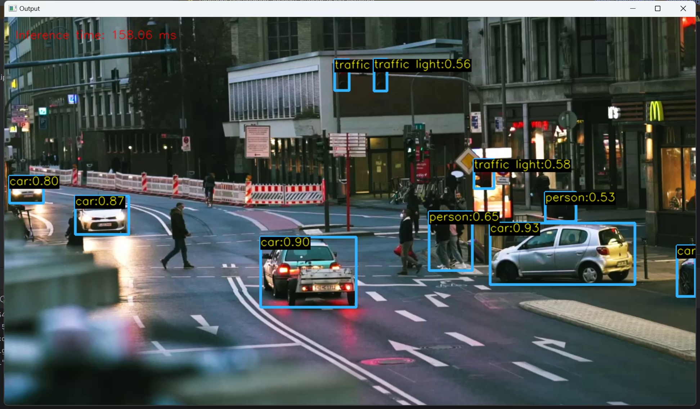
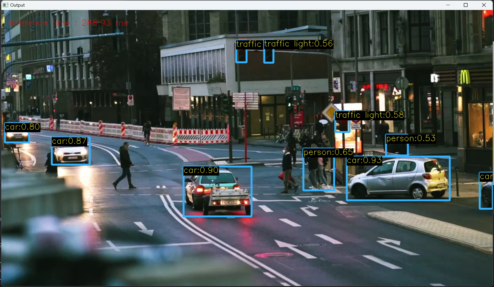

# YOLO-Automation: A YOLO Model Evaluation Suite

Welcome to the YOLO Object Detection Model Automated Inference and Evaluation repo, a comprehensive suite of tools and scripts dedicated to the evaluation and benchmarking of YOLO object detection models. This toolkit is crafted for developers, researchers, and enthusiasts aiming to explore the nuances of model performance, specifically focusing on the YOLO architecture. Whether you're comparing the intricacies of C++ and Python implementations or evaluating different YOLO model versions, this toolkit provides an automated, user-friendly approach to assessing object detection capabilities by comparing the performance and inference time of different YOLO models.

## Features

- **Cross-Language Implementation Comparison**: Seamlessly compare the output equivalence of YOLO models between C++ and Python implementations. This feature is designed to ensure consistency and reliability across different development environments.

- **Model Performance Benchmarking**: Dive into the performance metrics of various YOLO models, including YOLO5s, YOLOv5n and YOLOv5m. Our toolkit facilitates an in-depth comparison of detection performance and inference speed, providing insights into the most efficient and accurate models for your object detection needs.

# Getting Started

## Sample Run Result

The original codes in python and cpp are tested and verified their perfomance consistency on the `sample.jpg`

Python inference on `sample.jpg`



Cpp inference on `sample.jpg` (inference time debatable since it is on debug mode with MinGW compiled openCV lib)


The original codes are then modifed to serve the purpose of automation.

## Getting Started

Clone the repository and `cd` into the directory to begin:

```bash
git clone [URL_TO_THIS_REPO]
cd [LOCAL_PATH_TO_THIS_REPO]
```

## Repository Structure

- `utils/`: Contains utility scripts and modules to support the main tasks.
- `models/`: Includes ONNX YOLO models such as YOLO5s, YOLO5n and YOLO5m used for comparisons.
- `json/`: Stores JSON cpp header files.
- `.gitignore`: Configured to ignore COCO dataset folders and the result folders and IDE configuration files.
- `CMakeLists.txt`: CMake configuration for building C++ files.
- `Convert_PyTorch_models.ipynb`: Jupyter notebook to convert PyTorch models.
- `automate_ci_task.py`: Main script to automate task (ci), checking implementation equivalence.
- `automate_cii_task.py`: Main script to automate task (cii), comparing model performance.
- `things.yaml`: A structured files used to control the configurations, display and directories to folder, help to run Python files from the current working directory.
- `load_zip_file.py`: A useful file to help unzip the downloaded coco dataset into the current working directory. 
- Other supportive scripts and configuration files.

## Main Scripts

- `automate_ci_task.py`: This script is used to validate the equivalence of C++ and Python YOLO outputs (post NMS).
- `automate_cii_task.py`: Facilitates the comparison between YOLO5n and YOLO5m models, in terms of detection performance and inference time.

## Get COCO Datasets

The coco datasets needs to be downloaded in advance since the tasks rely on the dataset, it is for the best to download and unzip the dataset into the current working directory.
Here is the link to [val2017.zip](http://images.cocodataset.org/zips/val2017.zip) and [coco2017labels.zip](https://github.com/ultralytics/yolov5/releases/download/v1.0/coco2017labels.zip).
The first unzipped validation images should be those validation images as in `./coco/images/val2017`, and the second file serves as the `./coco/` folder.


```YAML
img_source_file: "coco/val2017.txt"
ann_path:  "coco/annotations/instances_val2017.json"
```

## Result Saving

The results can be saved as text files within an automatically generated directory. Additionally, results are available in terminal print-out format and visualized prediction results (i.e., picture results).

## Configuration

The YAML file (`things.yaml`) contains important parameters to control:

- Enables switching between any of the three available YOLO models for task ci.
- Allows the comparison of either two of the three models for object detection task performance evaluation in task cii.

There are several parameters that control whether a print-out report or a text report or the visualizing images are saved or not.

```yaml
ci_task/cii_task:
    vis_pred: True
    vis_gt: True
    log_pred: True
    log_gt: True
    terminal_pred: True
    terminal_gt: True
    save_image: True
```
By editing the YAML boolean flag, you would be able to control the display.

## Requirements
The python packages required are:

`PyYAML`

`opencv-python`

`pycocotools`

You can run the following scripts to install the necessary packages. 
```
pip install -r requirements.txt
```

## Building C++ Files

C++ Files need to be built first! before carrying out the automation task and the directory name should be consistent as in the `things.yaml` so that the python automating script can find the correct file to run!

Instructions for building the C++ files with CMake:

Windows:

Please be aware that Windows have different compilers. Ensure that the compiled OpenCV lib is consistent with
the current compiler. For example, if OpenCV package is built with Visual Studio, shall the current folder be compiled with the same compiler. If the 
OpenCV package is built with MinGW, careful that the current C++ project should be built with it too!

An example of using MinGW to build the current folder is:

```
rmdir /s /q build
cmake -G "MinGW Makefiles" -S . -B build
cmake --build build --config Release
```
But if using MinGW, the .exe file directory needs to be changed

The general command lines for building the cpp projects can be:
```
rmdir /s /q build
cmake -S . -B build
cmake --build build --config Release
```

If you want to run the C++ code, make sure you `cd` to the current working directory (not the build directory), and use the following command:

Windows
```
.\build\Release\Med_TA.exe sample.jpg model\yolov5s.onnx
```

### Evaluating Implementation Equivalence

To compare the equivalence of YOLO outputs between C++ and Python, ensuring that your development environment can handle both programming languages with the necessary dependencies. Then, execute the following command:

```bash
python automate_task_i.py
```

This script automates the comparison process, providing a detailed report on the equivalence of the outputs post-Non-Max Suppression (NMS), a crucial step for accurate object detection.

### Benchmarking Model Performance

For a comprehensive evaluation of YOLO models, focusing on the lightweight YOLOv5n and the more robust YOLOv5m, use the following command:

```bash
python automate_task_ii.py
```

This script compares the two models across various metrics, including detection accuracy, precision, recall, and inference time, offering valuable insights into the trade-offs between model complexity and performance.
